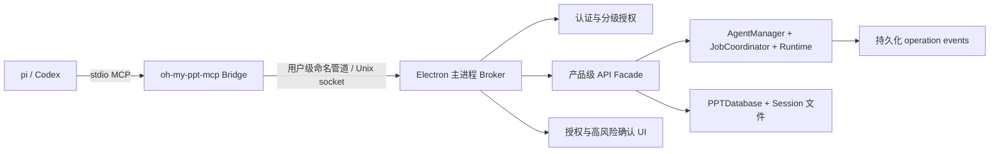

# 外部 Agent 本地接入设计规格：MCP Bridge 与 Electron Broker

- **状态**：待实施
- **版本**：v0.1
- **适用范围**：pi、Codex 等与 Oh My PPT 运行在同一台机器上的外部 Agent
- **原则**：本地优先、最小暴露、复用现有产品级 Runtime、不绕过既有校验

## 问题陈述（Problem Statement）

当前 Oh My PPT 的生成、编辑、导入、导出和 Session 管理能力主要通过 Electron renderer IPC 提供。外部 Agent 没有稳定、受控且可恢复的产品级入口，只能面对以下问题：

- 无法在明确授权后安全地发现和操作指定 Session。
- 直接复用 renderer IPC 会把 UI 专用参数、文件路径和对话框行为暴露给外部进程。
- 生成、批量编辑、PPTX 导入和导出是长任务；stdio 断线、应用重启或 Agent 重试时，当前没有统一的 operation、幂等和事件补偿契约。
- Session、工作区、文件路径、Product Skills、模型凭据和删除操作需要不同的安全边界，不能用一个全局开关覆盖。
- 外部 Agent 需要连续完成“读取 → 规划 → 创作 → 导入素材 → 导出”的工作流，同时不能绕过页面验证、资源刷新、历史记录和任务锁。

## 解决方案（Solution）

增加一条独立的本地 Agent 接入层：外部 Agent 通过标准 MCP 连接独立的 `oh-my-ppt-mcp` stdio Bridge；Bridge 通过固定的用户级本地端点连接 Electron 主进程 Broker。Broker 负责认证、授权、Session 和工作区边界、幂等、任务队列、事件持久化及高风险确认，然后调用主进程中的产品级服务。



用户通过应用内首次连接弹窗批准 Agent。默认授予全部非删除能力，但权限仍按 Agent、Session、工作区根目录和能力分别记录；删除页面、删除 Session，以及覆盖已有导出文件，必须逐次由应用弹窗确认。应用未运行时 Bridge 不自动启动应用；应用退出时任务保存 checkpoint，重启后由 Agent 显式恢复。

Bridge 不读取数据库、不直接修改 Session 文件、不加载 Product Skills，也不复制生成和编辑逻辑。Electron renderer 现有 IPC 保持兼容；Broker 调用抽取后的主进程产品服务，避免把 IPC handler 当作外部 API。

## 用户故事（User Stories）

1. 作为 pi 或 Codex Agent，我希望通过标准 MCP 初始化并发现 Oh My PPT 的协议版本，以便在调用前确认兼容性。
2. 作为本机用户，我希望外部 Agent 只能通过本机用户级管道或 Unix socket 接入，以便不暴露局域网或远程服务。
3. 作为外部 Agent，我希望在 Oh My PPT 未运行时收到明确的 `APP_NOT_RUNNING` 错误，以便提示用户启动应用，而不是静默失败或启动隐藏实例。
4. 作为本机用户，我希望首次 Bridge 连接时看到授权弹窗，以便知道哪个 Agent 正在请求访问。
5. 作为本机用户，我希望授权弹窗显示 Agent 名称、声明的可执行文件路径、请求的能力、Session 和工作区根目录，以便在批准前了解影响范围。
6. 作为本机用户，我希望首次授权默认勾选全部非删除能力，以便连续创作流程不被重复确认打断。
7. 作为本机用户，我希望能在授权弹窗中取消某一项能力，以便只授予当前工作流需要的权限。
8. 作为本机用户，我希望 Agent 的权限绑定到明确的 `sessionId`，以便 Agent 不能凭当前窗口选择隐式访问其他 Session。
9. 作为本机用户，我希望为 Agent 授权一个或多个工作区根目录，以便控制导入素材和导出文件的范围。
10. 作为本机用户，我希望授权持续到主动撤销，以便长期自动化工作流不需要周期性重新配对。
11. 作为本机用户，我希望在设置页查看 Agent、能力、Session、工作区和最近使用时间，以便审查当前授权。
12. 作为本机用户，我希望撤销 Agent 或某个 Session/工作区授权后立即阻止新调用并取消相关任务，以便撤销具有即时效果。
13. 作为外部 Agent，我希望获取协议限制、可用画布尺寸、样式 ID/名称/版本和支持的操作，以便提交有效的结构化请求。
14. 作为外部 Agent，我希望列出获得授权的 Session，以便选择明确的创作目标。
15. 作为外部 Agent，我希望读取 Session 的结构化快照，以便了解标题、页数、状态、尺寸、样式和生成进度。
16. 作为外部 Agent，我希望读取页面的大纲、页面状态和受控相对素材引用，以便规划编辑而不接触绝对文件路径或原始 HTML。
17. 作为外部 Agent，我希望使用已存在的 Session 素材引用，以便在生成和编辑时复用图片、视频和文档素材。
18. 作为获得创建权限的外部 Agent，我希望创建新的 Session，以便从主题、画布尺寸和样式开始创作。
19. 作为外部 Agent，我希望创建的新 Session 使用 Oh My PPT 已配置的 storage 根目录，以便沿用应用现有的 Session 生命周期和目录管理。
20. 作为外部 Agent，我希望生成任务使用 Oh My PPT 当前激活的模型，以便不传递或暴露 API Key 和模型配置。
21. 作为外部 Agent，我希望用结构化主题、提示词、页面目标和内容输入启动整套生成，以便创建可验证的 deck。
22. 作为外部 Agent，我希望用结构化输入编辑单页，以便修改页面内容而不提交任意 HTML、CSS 或 JavaScript。
23. 作为外部 Agent，我希望用结构化输入编辑整套 deck，以便执行跨页调整并保留产品级页面约束。
24. 作为外部 Agent，我希望从授权工作区路径导入 PPTX，以便把外部演示文稿纳入 Oh My PPT 的可编辑 Session。
25. 作为外部 Agent，我希望导入图片、视频或文档素材到指定 Session，以便在后续生成和编辑中使用这些素材。
26. 作为外部 Agent，我希望把 Session 导出为 PPTX 到授权路径，以便把结果交付给用户或其他工具。
27. 作为本机用户，我希望导出默认不覆盖已有文件，以便避免意外丢失已有交付物。
28. 作为外部 Agent，我希望长任务立即返回 `operationId`，以便不依赖单次 MCP 请求保持连接直到完成。
29. 作为外部 Agent，我希望同一 Session 的写任务按 FIFO 排队，以便 UI、多个 Agent 和当前任务不会互相覆盖。
30. 作为外部 Agent，我希望订阅实时 operation 通知，以便及时显示生成、编辑、导入或导出的进度。
31. 作为外部 Agent，我希望断线重连后按游标补齐持久化事件，以便不丢失中间进度和终态信息。
32. 作为外部 Agent，我希望取消排队或运行中的任务，以便停止不再需要的模型调用或文件操作。
33. 作为外部 Agent，我希望应用重启后查询并显式恢复可恢复的 operation，以便从 checkpoint 继续而不是重复执行全部任务。
34. 作为外部 Agent，我希望为所有有副作用的调用提供 `idempotencyKey`，以便网络重试不会重复创建、编辑、导入或导出。
35. 作为外部 Agent，我希望收到稳定的错误码、可重试标记和安全的诊断信息，以便自动决定重试、重新读取或请求用户处理。
36. 作为本机用户，我希望删除页面或 Session 前看到精确的目标、影响和 Agent 身份，以便确认不可逆操作。
37. 作为本机用户，我希望覆盖已有导出文件前看到覆盖目标和路径，以便确认文件不会被静默替换。
38. 作为外部 Agent，我希望生成或编辑完成后得到结构化结果、警告和关联历史 operation，以便判断交付是否完整。
39. 作为外部 Agent，我希望部分页面失败时得到明确的 `partial` 状态和失败页面信息，以便只重试必要部分。
40. 作为本机用户，我希望应用 UI 与外部 Agent 共用同一套任务锁、校验、历史和 asset 刷新机制，以便两条入口的行为一致。
41. 作为本机用户，我希望审计记录只包含 Agent、工具、Session、operationId、时间、结果和错误码，以便追踪行为而不把敏感内容复制到审计库。
42. 作为维护者，我希望未知协议版本被明确拒绝而不是静默降级，以便避免升级后产生语义不一致的结果。

## 实施决策（Implementation Decisions）

1. **进程边界**
   - 新增独立的 MCP stdio Bridge 和 Electron 主进程 Broker。
   - Bridge 只负责 MCP 初始化、工具 schema、请求转发、端点发现和连接生命周期。
   - Broker 负责所有信任边界和产品服务调用；不让外部进程直接调用 renderer IPC、数据库或 Session 文件。
   - 现有 renderer IPC 作为兼容入口保留，外部 API 通过共享的产品服务复用既有实现。

2. **本地传输与生命周期**
   - Windows 使用用户级命名管道；macOS/Linux 使用用户级 Unix socket。
   - 端点名称固定且按 OS 用户隔离；不监听 TCP，不接受局域网连接。
   - Broker 在数据库、样式、Product Skills 和主进程 Runtime 初始化完成后启动。
   - Electron 单实例生命周期与 Broker 绑定：窗口隐藏到托盘时 Broker 仍可用，进程退出时 Broker 关闭。
   - 应用未运行或端点不可用时，Bridge 返回 `APP_NOT_RUNNING` 或 `BROKER_UNAVAILABLE`，不自动拉起应用。

3. **认证与本机威胁模型**
   - 首次连接建立本地客户端身份和可撤销凭据；后续请求必须证明持有该凭据。
   - 凭据使用 nonce/请求序列或等价机制防止重放；凭据与 Agent 身份记录保存在应用用户数据目录，并按平台文件权限保护。
   - 弹窗显示的可执行文件路径是用户判断依据，不作为安全证明；首版信任同一 OS 用户，不承诺抵御同一用户下的恶意进程。
   - 不把 API Key、模型配置密钥或 Session 文件内容放进 Bridge 凭据、MCP payload 或错误信息。

4. **授权模型**
   - 授权记录至少包含 Agent 身份、能力集合、明确 Session 集合、工作区根目录集合、创建时间、最近使用时间和撤销时间。
   - 默认能力为全部非删除能力：读取、创建 Session、生成、页面编辑、整套编辑、PPTX 导入、素材导入、PPTX 导出和任务控制。
   - 删除页面、删除 Session 不提供长期删除 grant；调用仍需通过 Session 授权，但每次都创建 `awaiting_confirmation` operation。
   - 授权不使用当前窗口选中的 Session；每次产品调用必须显式携带 `sessionId`，创建新 Session 时使用已授权工作区作为文件交换范围。
   - 撤销 Agent、Session 或工作区权限立即拒绝新请求，并取消该 Agent 相关的排队和运行任务；事件和审计记录撤销原因。

5. **Broker 的唯一产品 seam**
   - 以一个高层 `ExternalAgentBroker` 请求边界作为外部接入的主要测试和运行 seam。
   - Broker 内部依赖窄接口：授权服务、Session resolver、路径策略、产品 API facade、operation store、任务队列、事件发布器和确认 UI 适配器。
   - 生成、编辑、导入、导出服务从 UI handler 中抽取为可无窗口调用的产品服务；Broker 不通过模拟 renderer 事件来复用业务。
   - 该 seam 必须在调用产品服务前统一执行协议解析、能力校验、Session 授权、路径校验、幂等检查和撤销检查。

6. **MCP 产品 API**
   - 只提供以下首版产品工具：
     - 读取：`get_capabilities`、`list_sessions`、`get_session`、`get_page`。
     - 创作：`create_session`、`start_generation`、`edit_page`、`edit_deck`。
     - 文件：`import_pptx`、`import_assets`、`export_pptx`。
     - 任务：`get_operation`、`get_operation_events`、`subscribe_events`、`cancel_operation`、`resume_operation`。
     - 高风险：`delete_page`、`delete_session`。
   - `initialize` 协商客户端协议版本和客户端信息；`get_capabilities` 返回服务端版本、画布尺寸、样式目录摘要、限制和支持的工具。
   - 读取结果只返回结构化 Session/page snapshot、文本大纲、状态、尺寸、样式和受控相对 asset 引用；不返回绝对路径、原始 HTML、CSS、JavaScript 或 Product Skill 文档。
   - 创建和编辑只接受结构化产品参数、提示词、页面目标、内容结构、`styleId` 和 `slideSizeId`；Broker 拒绝任意页面片段和原始文件写入。
   - 首版只支持 PPTX 导入和 PPTX 导出；PDF、PNG、视频、模板、字体和样式管理不进入本次契约。

7. **Product Skills 与模型**
   - Product Skills 只在主进程 Agent Runtime 内部读取，继续保持只读和技能名称过滤。
   - Broker 只校验样式 ID、画布尺寸和产品参数；不向 MCP 暴露 `SKILL.md`、references 或内部技能路径。
   - 生成和编辑统一使用当前激活模型；MCP 不提供模型配置列表、`modelConfigId` 选择、provider/base URL 或 API Key 输入。
   - 产品服务继续负责布局、样式、图表、动画、HTML 验证、资源完整性检查和 Session asset 刷新。

8. **Session 创建与存储**
   - `create_session` 需要独立的 Session 创建权限、已授权工作区根目录、标题、`styleId`、`slideSizeId` 和 `idempotencyKey`。
   - 新 Session 的实际项目目录仍由 Oh My PPT 配置的 storage 根目录决定；工作区根目录只用于外部文件导入、素材读取和导出写入，不能让 Agent 把 Session 存到任意目录。
   - `import_pptx` 按现有产品语义创建新的 Session，并在成功后将该 Session 绑定到发起 Agent 的授权范围。
   - 删除 Session 必须处理数据库记录、Session 关联 operation、页面和项目资源；确认弹窗要展示删除范围，执行前先停止该 Session 的其他任务。

9. **文件与素材边界**
   - MCP 不承载 base64 或分块二进制；导入接口只接受 `sourcePath`，导出接口接受 `outputPath`。
   - Broker 对源文件和目标路径执行规范化、`realpath`、符号链接越界检查、根目录包含检查和最终存在性检查；Windows 路径比较按平台规则处理大小写和分隔符。
   - PPTX 源文件必须位于已授权工作区根目录，校验 `.pptx` 扩展名和现有 500MB 上限；通过校验后复制到应用管理的 Session 导入流程，不把外部路径直接传入现有 UI handler。
   - 素材导入沿用现有 Session 复制机制和单文件 20MB 上限：图片支持 png/jpg/jpeg/webp/gif/svg，视频支持 mp4/webm/ogg，文档支持 md/txt/text；返回 `./images/...`、`./videos/...` 或 `./docs/...` 形式的相对引用。
   - PPTX 导出只能写入已授权工作区根目录或目标 Session 的 exports 目录。默认目标存在即返回 `EXPORT_TARGET_EXISTS`；`overwrite: true` 创建确认 operation，批准后使用临时文件和原子替换。
   - 任何文件错误只返回安全的错误详情，不把未授权目录结构或文件内容泄露给 Agent。

10. **写入、历史与资源一致性**
    - 生成和编辑在现有参数校验、Product Skills、页面验证、历史记录和 asset 刷新完成后直接提交到 Session，不增加独立草稿层。
    - 每个外部 operation 与产生的历史 operation 关联，并保留 before/after 快照或现有历史系统能够恢复的等价引用。
    - 页面编辑、整套编辑、生成、导入和导出都必须使用既有的业务服务；禁止在 Broker 中复制一套简化 HTML 写入逻辑。
    - 部分页面失败必须保留已完成页面的合法结果，operation 返回 `partial`、完成/失败计数、失败页面和安全警告；不得把失败伪装为空结果。

11. **Operation 生命周期与异步契约**
    - 查询和轻量元数据读取同步返回；生成、AI 编辑、PPTX 导入、素材批量导入和 PPTX 导出返回 `operationId`。
    - 外部状态机采用以下语义：

      ```text
      queued -> running -> completed
                       -> partial
                       -> failed
                       -> cancelled
                       -> interrupted

      queued/running -> awaiting_confirmation -> running
                                             -> rejected
                                             -> expired

      queued/running/awaiting_confirmation -> revoked
      ```

    - `get_operation` 返回 operation 类型、Agent、Session、状态、进度、checkpoint 摘要、结果引用、错误码、创建/更新时间和是否可恢复。
    - `cancel_operation` 通过 JobCoordinator 的 AbortSignal 终止等待和运行任务，并持久化取消原因；已经提交的合法页面结果按现有回滚/partial 语义处理。
    - `resume_operation` 只接受同一 Agent 对同一 Session 的授权请求，并要求新的幂等键；只恢复标记为 resumable 且有 checkpoint 的 operation，不重复已完成的页面或文件。
    - 关闭流程先停止接收新请求、停止队列出队、为可恢复任务保存 checkpoint，再将任务标记为 `interrupted` 并关闭 Broker/数据库；应用未运行期间不执行任务。

12. **Session 写队列与并发**
    - 同一 Session 的所有写任务（包括 renderer UI、外部 Agent 和未来 CLI）共享 Session 级资源锁。
    - 在 Broker 前增加薄的 FIFO Session operation queue，把外部请求状态先记录为 `queued`，再交给现有 `JobCoordinator` 和 `ResourceLock`。
    - 现有 `JobCoordinator` 的 lease、AbortSignal 和资源声明继续作为真正的执行锁；队列不复制锁逻辑。
    - 同一 Session 的读取可以并行，但读取结果必须在响应生成时再次验证 Session 是否仍被授权。
    - 不允许多个写任务并行覆盖同一 Session；不使用以后者覆盖或隐式自动合并作为首版冲突解决方案。

13. **幂等与重试**
    - 所有有副作用的调用都必须携带 `idempotencyKey`，包括创建、生成、编辑、导入、导出、取消和恢复。
    - Broker 按 Agent 身份和幂等键建立唯一记录，同时保存规范化请求哈希；相同 key 且请求哈希相同则返回原 operationId、当前状态或原结果。
    - 相同 key 对应不同请求时返回 `IDEMPOTENCY_KEY_REUSED`；不能用短时间内的参数猜测替代客户端幂等键。
    - Bridge 超时或断线后应优先重试同一 key，再考虑创建新 operation。

14. **事件与断线恢复**
    - 每个外部 operation 拥有单调递增的 `sequence`；事件至少包含 operationId、sequence、类型、发生时间和经过脱敏的 payload。
    - `subscribe_events(operationId, afterSequence)` 先补发持久化事件，再通过 MCP 通知推送新事件；Agent 重连时重复执行同一游标订阅不会丢事件。
    - `get_operation_events` 是无实时连接时的补偿读取接口，支持游标、分页和有限上限。
    - 默认事件类型包括 `queued`、`started`、`progress`、`page_started`、`page_completed`、`warning`、`confirmation_required`、`completed`、`partial`、`failed`、`cancelled`、`interrupted` 和 `revoked`。
    - 事件不得包含完整 prompt、API Key、模型响应全文、原始 HTML、文件内容或未授权绝对路径；进度只发送阶段、页号、计数、错误码和受控摘要。
    - 现有 renderer 专用 `generation.chunk` 转译不作为外部事件契约；新增外部事件适配器把内部 Runtime 事件映射为稳定的 operation 事件。

15. **高风险确认**
    - `delete_page`、`delete_session` 和 `export_pptx(overwrite=true)` 在执行副作用前创建 `awaiting_confirmation` operation。
    - 应用弹窗展示 Agent 名称、Session 标题和 ID、目标页面/文件、具体操作、预计影响和不可逆性；不接受 Agent 自己返回的确认字段作为批准。
    - 用户批准后 Broker 重新检查授权、Session、路径和 operation 状态，再执行；拒绝或有界超时后分别记录 `rejected` 或 `expired`。
    - 建议确认等待默认上限为 5 分钟；超时值属于应用配置，不允许通过 MCP 请求无限延长。
    - 撤销授权优先于确认批准；已撤销的 confirmation 即使用户界面残留也不得执行。

16. **持久化模型**
    - 新增最小的外部 Agent 身份、授权 grant、外部 operation、operation event 和待确认请求持久化记录。
    - Agent 身份记录保存公钥或等价本地凭据标识、显示名称、声明路径、创建/撤销时间和最后使用时间。
    - grant 记录保存能力集合、Session 集合、工作区根目录集合和状态；根目录以规范化形式保存，展示时按平台还原。
    - operation 记录保存 Agent、Session、工具类型、幂等键、请求哈希、状态、checkpoint、结果引用、错误码和时间戳；通过唯一约束保证幂等。
    - event 记录保存 operationId、sequence、稳定事件类型、脱敏 payload 和发生时间。
    - 外部 operation 生命周期与 `session_operations` 历史记录分离，但在产生 Session 历史时保存关联 ID，避免把连接重试状态混入历史语义。
    - 终态 operation 的事件和最小审计信息按有限保留策略清理；活动、interrupted 和可恢复 operation 在完成或明确放弃前不得清理。

17. **协议版本与错误契约**
    - Bridge 与 Broker 在初始化时显式协商 `protocolVersion`；Broker 支持当前版本和一个兼容旧版本，未知版本返回 `PROTOCOL_VERSION_UNSUPPORTED`，不静默降级。
    - 错误统一采用以下结构，`details` 只允许安全、有限、可序列化信息：

      ```text
      {
        ok: false,
        error: {
          code: string,
          message: string,
          retryable: boolean,
          details?: object
        },
        operationId?: string
      }
      ```

    - 首批稳定错误码包括：`APP_NOT_RUNNING`、`BROKER_UNAVAILABLE`、`AUTH_REQUIRED`、`AUTH_REVOKED`、`NOT_AUTHORIZED`、`SESSION_NOT_GRANTED`、`WORKSPACE_NOT_GRANTED`、`SESSION_NOT_FOUND`、`PROTOCOL_VERSION_UNSUPPORTED`、`IDEMPOTENCY_KEY_REQUIRED`、`IDEMPOTENCY_KEY_REUSED`、`PATH_OUTSIDE_AUTHORIZED_ROOT`、`SYMLINK_ESCAPE`、`FILE_TYPE_UNSUPPORTED`、`FILE_TOO_LARGE`、`EXPORT_TARGET_EXISTS`、`CONFIRMATION_EXPIRED`、`OPERATION_NOT_FOUND`、`OPERATION_NOT_RESUMABLE`、`OPERATION_REVOKED`、`PRODUCT_SKILLS_NOT_READY`、`ACTIVE_MODEL_NOT_CONFIGURED`、`SHUTTING_DOWN` 和 `VALIDATION_FAILED`。
    - `retryable` 必须反映真实语义：版本、权限、路径、参数和过期确认错误不可盲目重试；端点暂不可用、排队、瞬时模型或文件锁错误可由 Agent 根据状态重试。

18. **设置页与用户可见性**
    - 设置页增加本机 Agent 管理区域，展示连接状态、Agent 名称、声明路径、授权能力、Session、工作区根目录、创建时间、最近使用时间和撤销操作。
    - 设置页提供修改 grant 的入口；修改 Session 或工作区时先停止受影响的后续调用，并按撤销规则取消相关任务。
    - 授权弹窗和高风险确认弹窗必须可访问、可键盘操作、明确区分批准和拒绝，并在应用隐藏到托盘时仍能被用户找到。
    - UI 不显示 API Key，不把完整 prompt 或文件内容写入 Agent 审计列表。

19. **审计与隐私**
    - 最小审计字段为 Agent、工具、Session、operationId、时间、结果状态、错误码和撤销/确认结果。
    - 不记录 API Key、完整 prompt、文件内容、原始 HTML/CSS/JS、模型响应全文或未授权路径。
    - Agent 只能查询自己发起的 operation；应用用户可查看所有本地 Agent 的最小审计记录。
    - 安全事件（认证失败、越权、路径拒绝、幂等冲突、撤销、确认拒绝）与普通业务失败使用不同事件类型，便于排查。

20. **打包与兼容**
    - 当前项目没有 MCP SDK；实现阶段加入官方 MCP TypeScript SDK，并将 Bridge 作为与 Electron 应用版本同步的独立入口/可执行启动器打包。
    - MCP 配置只需要稳定的 Bridge 启动命令；Bridge 自动发现固定本地端点，不要求用户维护动态端口。
    - 共享协议 schema 必须由 Bridge 和 Broker 同时消费，并在版本升级测试中验证工具名称、输入校验和错误码兼容。
    - 现有 renderer IPC、Session 数据、历史记录和应用设置保持向后兼容；新表/字段采用可重复执行的数据库迁移。

21. **实施阶段与粗略工期**
    - **阶段一：契约与只读链路（1–2 天）**：共享 schema、MCP 初始化、固定本地端点、Broker seam、首次授权弹窗、能力目录、Session/page 结构化读取。验收：未授权、错误 Session、应用未运行和脱敏读取均正确。
    - **阶段二：operation 基础设施（3–5 天）**：外部身份/grant 持久化、幂等键、Session FIFO、状态机、事件表、游标补偿、取消和关闭 checkpoint。验收：断线、重试、并发、撤销和重启恢复均不重复或越权。
    - **阶段三：创作与文件闭环（4–7 天）**：创建 Session、生成、单页/整套编辑、受控素材导入、PPTX 导入导出、覆盖确认。验收：全部调用经过既有 Runtime、校验、历史和 asset 刷新。
    - **阶段四：设置与跨平台硬化（3–5 天）**：Agent 管理页、审计、撤销、Bridge 打包、Windows 命名管道、macOS/Linux Unix socket、真实 stdio MCP 客户端和故障恢复矩阵。

## 测试决策（Testing Decisions）

1. **最高测试 seam**
   - 以 `ExternalAgentBroker` 的请求/响应边界作为唯一主要新增 seam，测试从认证到产品服务结果的外部行为。
   - 通过注入窄接口替换数据库、授权存储、路径解析、队列、产品服务、事件存储和确认 UI；不在单元测试中启动真实模型或修改真实用户目录。
   - MCP Bridge 的 schema/传输测试使用同一共享契约，避免为 Bridge 和 Broker 各写一套互相漂移的断言。

2. **必须验证的外部行为**
   - 授权矩阵：首次批准、默认非删除权限、缺失能力、Session 越权、工作区越权、撤销即时生效和同账号威胁边界说明。
   - 路径边界：绝对路径、相对路径、路径穿越、符号链接逃逸、大小写差异、缺失父目录、错误扩展名和大小上限。
   - 幂等与状态：相同 key 重试返回同一 operation，不同 payload 拒绝；状态转移、重复取消、过期确认和不可恢复 operation 有稳定结果。
   - 队列与取消：同一 Session FIFO、不同 Session 并行、UI 与 Agent 共享锁、排队取消、运行取消和撤销取消。
   - 事件可靠性：sequence 单调、游标补偿无遗漏/重复影响、断线重连先补历史再接实时通知、终态可查询。
   - 数据脱敏：读取响应、错误、事件和审计中不存在 API Key、完整 prompt、原始 HTML、文件内容和未授权绝对路径。

3. **模块与测试先例**
   - 复用 `JobCoordinator`/`ResourceLock` 的等待、冲突和 AbortSignal 测试先例，验证外部队列只增加排队语义而不复制锁实现。
   - 复用 generation job manager、page edit、deck edit、session jobs 数据层的状态恢复和终态持久化测试先例。
   - 复用 import boundary、PPTX 导出 routing、page management 和 Runtime event bridge 的既有边界测试先例。
   - 对数据库迁移测试使用临时 SQLite，验证唯一幂等键、级联删除、事件顺序和重启后可恢复记录。

4. **集成与验收矩阵**
   - 使用真实 stdio MCP 客户端完成 initialize、能力发现、读取、创建、生成、编辑、素材导入、PPTX 导入导出和任务控制。
   - 使用临时授权工作区和临时 Session，覆盖应用运行、窗口隐藏/托盘、应用退出、重启、Broker 不可用和凭据撤销。
   - Windows 验证命名管道；macOS/Linux 验证 Unix socket、用户目录权限和进程退出清理；各平台验证路径规范化。
   - 生成/编辑类集成测试使用固定的 fake model/product service，另以少量手工验收确认真实应用 UI、确认弹窗和导出文件。
   - 测试只断言产品行为、稳定 schema、状态和安全边界，不断言内部类的调用次数、私有字段或具体文件布局。

5. **验证命令约束**
   - 按仓库规则优先运行最小相关 Vitest、类型检查和 `git diff --check`。
   - 不运行 `npm run lint` 或 `npm run build` 作为本规格的一部分。

## 范围外（Out of Scope）

- 局域网、远程主机、云端 Broker、HTTP MCP 服务和公网访问。
- Bridge 自动启动 Oh My PPT、应用未运行期间执行任务或无 UI 的后台服务模式。
- 首版 CLI；CLI 后续复用同一产品控制契约。
- 任意文件读写、任意 HTML/CSS/JS 写入、base64/分块二进制上传和原始文件工具镜像。
- 对外暴露或由外部 Agent 选择 Product Skills、模型配置、API Key、provider、base URL、字体、模板或样式包。
- 外部 Agent 直接执行历史回滚、样式管理、模板管理、字体管理、PDF/PNG/视频导出以及其他未列入核心创作闭环的用户能力。
- 同一 OS 用户下恶意进程的强身份验证、代码签名验证、跨用户服务隔离和企业级设备策略。
- 自动合并并发编辑、以后者覆盖、无用户确认的删除和覆盖已有导出文件。
- 将完整 prompt、页面 HTML、文件内容或模型响应保存到外部 Agent 审计记录。

## 补充说明（Further Notes）

- 现有主进程组合根已经集中创建数据库、`AgentManager`、`JobCoordinator`、Runtime event bus 和 IPC context；Broker 应挂在同一组合根，而不是另起一套数据库或 Agent Runtime。
- 现有 PPTX 导入会直接接受文件路径并创建 Session，现有 PPTX 导出会打开保存对话框；两者适合受信 renderer，不可原样暴露给 MCP。实现时应先抽取无窗口的产品服务，再由 renderer handler 和 Broker 共同调用。
- 现有 Product Skills backend 已有只读和技能名称过滤；外部接入应复用它的内部能力，不把技能路径变成新的文件授权根。
- 现有 `session_operations` 主要表达历史/提交语义，外部连接、幂等、事件和恢复状态应使用独立的外部 operation 记录，并保留关联关系。
- Session 存储根与外部工作区根是两个概念：前者由应用设置决定，后者只决定 Agent 可读的导入源和可写的导出目标。规格不得把二者合并。
- 本规格选择“校验后直接提交”而不是草稿层；安全性来自授权、结构化输入、产品验证、历史快照、Session 锁和逐次高风险确认。
- 本规格选择“持久化事件 + 游标补偿”而不是只推送实时事件；实时通知断开不影响 operation 的可追踪性。
- 连接凭据、MCP SDK 的具体版本、确认弹窗的最终视觉稿和各平台端点清理细节留在实施阶段确定，但不得削弱本规格中的本地边界、授权、幂等、恢复和脱敏要求。
